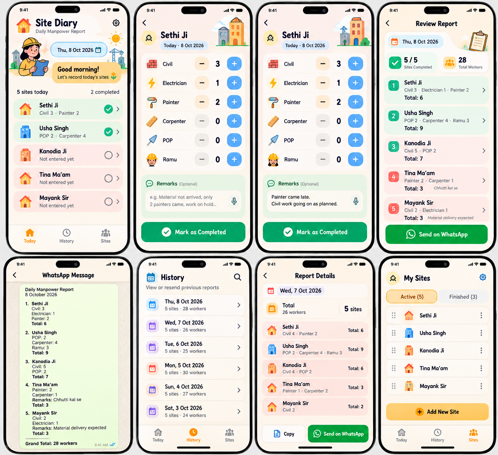

# 🏡 Site Diary

A cheerful, phone-first daily manpower reporting app for interior-design and construction sites. Built to replace hard-to-read handwritten WhatsApp updates.



## What it does

- **Today:** all active sites appear automatically. Every new India-calendar day starts with **blank counts** (nothing copied forward).
- **Enter people:** big +/− buttons or tap the number to type; Civil, Electrician, Painter, Carpenter, POP and Ramu are provided initially. Customize/add departments or contractor names.
- **Remarks:** optional note at every site. Phone keyboard dictation works if supported by the phone keyboard.
- **Complete a site:** counts are saved automatically as drafts, but a site appears in the report only when marked complete. An explicit **No workers at this site today** option avoids confusing zero and missing data.
- **WhatsApp:** a readable report with every site's positive worker counts, total and remarks; opens WhatsApp for the user to select head office and tap Send. No message is sent automatically.
- **History:** previous completed daily reports; tap any site on a past report to correct it, then mark it complete again.
- **Manage Sites:** add, rename, archive and reactivate sites. Archiving preserves old reports.
- **Backup:** export and restore all data as JSON. **Optional Supabase cloud backup** supports signing in by email on another device.
- **PWA:** install it to an iPhone or Android home screen. App shell is cached for offline opening after first load; local entries work without a network.

## Fastest deployment — GitHub → Vercel

1. Create a new GitHub repository, and upload **the contents of this folder** (including `package.json` at the repository root). You can also commit and push using Git.
2. In [Vercel](https://vercel.com/new), **Add New → Project → Import** your repository.
3. Framework should be **Vite**. Build command: `npm run build`; output directory: `dist`. These are already in `vercel.json`.
4. Click **Deploy**. Open the assigned `*.vercel.app` URL on your aunt's phone.
5. Add the app to the home screen: on iPhone, Safari → Share → **Add to Home Screen**; on Android, Chrome → menu → **Install app / Add to Home screen**.
6. Tap **My Sites → Add New Site** and add the active sites once. Go to **Today** and start using the app.

**Important:** Without optional cloud setup, diary records are stored **only in the browser on that phone**. This is enough for immediate use but deleting browser data, changing devices or using private browsing can erase records. Enable cloud backup for reliable everyday use, or download regular backups in Settings. Reports already sent through WhatsApp remain in the chat separately.

## Recommended: enable secure cloud backup (about 10 minutes)

The app is fully usable without a database, but for a real daily workflow we strongly recommend enabling Supabase so records aren't lost when a phone changes.

1. Create a [Supabase](https://supabase.com) project.
2. Open **SQL Editor**, paste and run `supabase/setup.sql` in this repo. The table has **row-level security**: each logged-in user can read and update only their own data.
3. In Supabase **Authentication → Providers**, enable email sign-in / OTP (follow your project's email provider configuration).
4. In **Authentication → URL Configuration**, set **Site URL** to your Vercel production URL (`https://your-site.vercel.app`) and add it under **Redirect URLs** too. If you use a custom domain, add that URL as well.
5. In Supabase **Project Settings → API / Connect**, copy the Project URL and **anon/publishable key**. Never use the `service_role`/secret key in a browser app.
6. In **Vercel → Project → Settings → Environment Variables** create:
   - `VITE_SUPABASE_URL` = project URL
   - `VITE_SUPABASE_ANON_KEY` = publishable/anon key
7. **Redeploy** so Vite includes those public configuration values.
8. On the phone, open **Settings → Cloud Backup**, enter her email, tap the link that arrives, and choose the right diary if prompted.

Cloud sync is a simple, single-user, last-write-wins backup, not a real-time multi-editor system. Avoid editing the same account simultaneously on multiple devices. When connecting a second device, choose **Use my cloud notebook**. When upgrading a phone, keep the old phone's JSON export as a safety copy. Internet is required to sign in and sync cloud data, but not to enter local counts.

If email delivery is delayed, check spam and Supabase Auth email/SMTP settings. Some Supabase default email providers have rate/delivery limits; production use may require configuring SMTP.

## Local development

Requires Node.js 20+ and npm:

```bash
npm install
npm run dev
```

Open the URL shown in the terminal (usually `http://localhost:5173`).

Verification commands:

```bash
npm run check   # TypeScript
npm run test    # date, backup and reporting logic
npm run build   # production bundle + PWA
```

Cloud settings can be copied to `.env.local` from `.env.example` if required.

## Everyday workflow

1. Open **Today**. All active sites show **Not entered yet** every fresh day.
2. Tap a site. Use +/− or type each head count, then optionally enter remarks.
3. Tap **Finish site**. If there are zero workers, tap **No workers at this site today** instead.
4. Repeat until the green progress bar reaches 100%.
5. Tap **Review & Share → Send on WhatsApp**. Pick head office, check the message, and send.
6. If someone reports a correction, edit the site and finish again. To correct an old day, visit **History → date → site**.

**Zero vs blank:** Unentered counts are displayed as a dash `–` and are ignored in the report. A completed site with zero workers is explicitly represented. Edits to previously completed sites require tapping Finish again to prevent a partially edited report being shared.

## Files / assets

- `src/App.tsx` — application UI and workflows.
- `src/styles.css` — responsive design system with warm notebook visual style.
- `src/types.ts`, `src/lib/` — data model, India date handling, validation and reporting.
- `public/illustrations/` — original vector illustrations (city, worker, empty house).
- `public/icons/` — app/home-screen icon SVG and PNG variants.
- `docs/DESIGN.md` — design tokens and screen behavior.
- `docs/approved-concept.png` — original concept reference (not used as a static screen in the live app).
- `supabase/setup.sql` — optional secured cloud table.
- `vite.config.ts` — Vite/React/PWA configuration.

## Privacy and deployment notes

- No analytics, trackers, ads or third-party fonts.
- No account necessary when using the local-only mode.
- Cloud data goes to your own Supabase project, only after the user signs in; RLS policies restrict access.
- Vite public environment variables are visible in the browser. Only put the Supabase *anon/publishable* key there.
- WhatsApp report text is sent to the WhatsApp website/app only when the user taps Send.
- The app's backup contains site names and remarks; treat it as a private file.
- On shared phones, use a separate app installation/browser profile per person unless intentionally sharing the same diary.
